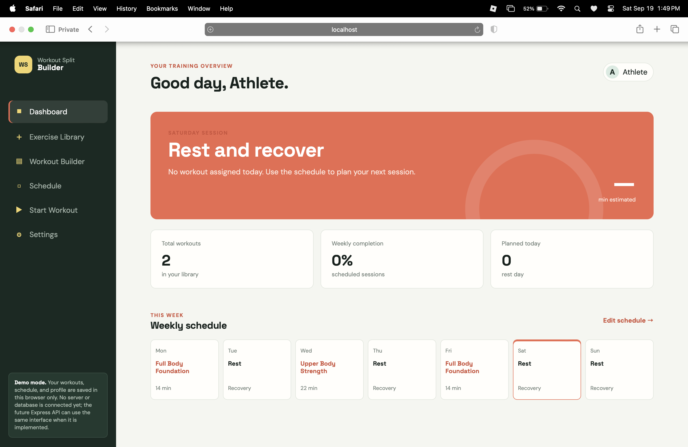
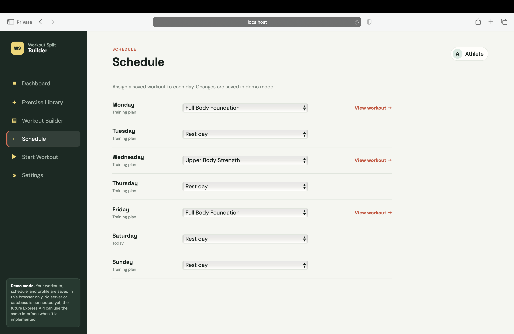
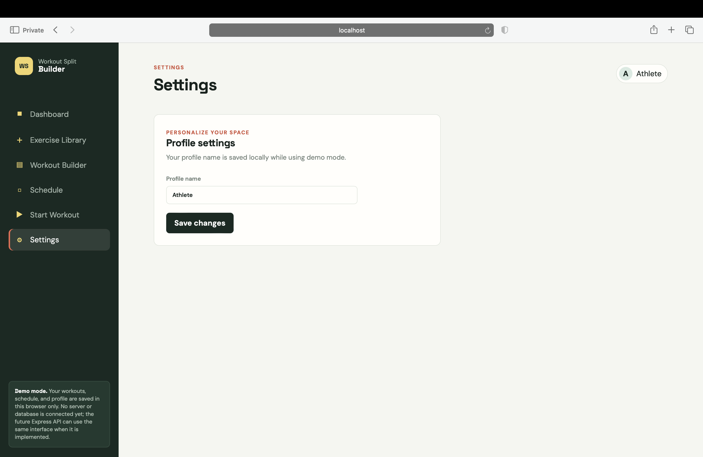

# Workout Split Builder

[](AI-USAGE.md)

Workout Split Builder is a full-stack web application for creating, organizing, scheduling, and completing weekly workout routines.

AI tools were used during development for planning, debugging, implementation support, documentation, and code review. See [AI-USAGE.md](AI-USAGE.md) for the project AI-use record.

**Live site:** https://workout-split-builder.onrender.com

**Public API:** https://workout-split-builder-api.onrender.com

**Demo video:** https://drive.google.com/drive/folders/1HNjNDwd8FaxfD8xLVRUFvjeHWkUZUZnI?usp=sharing

---

## 1. Overview

Workout Split Builder helps users create and manage workout routines in one place.

Users can:

- Browse and search exercises
- Filter exercises by muscle group, equipment, and difficulty
- Create custom workouts
- Add, remove, and reorder exercises
- Change sets, repetitions, and rest time
- Assign workouts to days of the week
- Start a workout and track completed exercises
- View workout progress
- Use a rest timer
- Update their profile name

The application uses:

- React and Vite for the frontend
- Node.js and Express for the backend
- PostgreSQL for persistent data storage

---

## 2. Setup and Installation

### Requirements

For local development:

- Node.js 20 or later
- npm
- PostgreSQL
- Git
- A modern web browser

### Clone the repository

```bash
git clone https://github.com/Keane03/workout-split-builder.git
cd workout-split-builder
```

---

## 3. Environment Configuration

### Client

Create a file named:

```text
client/.env
```

Add:

```env
VITE_USE_MOCK_API=false
VITE_API_BASE_URL=http://localhost:3000
```

Do not place passwords, API keys, database credentials, or other secrets in `VITE_` variables because Vite exposes these values to the browser.

### Server

Create a file named:

```text
server/.env
```

You can use `server/.env.example` as a guide.

Example:

```env
DATABASE_URL=<your-postgresql-connection-string>

CORS_ORIGINS=http://localhost:5173

NODE_ENV=development

APP_USERNAME=<your-app-username>
APP_PASSWORD=<your-app-password>
```

Real `.env` files must not be committed to Git.

---

## 4. Database Setup

Workout Split Builder uses PostgreSQL for persistent storage.

The database stores:

- Exercises
- Workouts
- Exercises assigned to workouts
- Weekly workout schedules
- Profile information
- Workout session completion data

From the `server` directory, initialize the database with:

```bash
npm run db:schema
npm run db:seed
```

The seed command adds the development exercise and workout data.

---

## 5. Running the Project Locally

### Start the backend

Open a terminal:

```bash
cd server
npm install
npm run dev
```

The API runs locally at:

```text
http://localhost:3000
```

### Start the frontend

Open another terminal:

```bash
cd client
npm install
npm run dev
```

Vite will normally provide:

```text
http://localhost:5173
```

Open that address in a browser.

When real API mode is enabled, the application displays a login screen. Use the username and password configured in the server environment.

---

## 6. Main Features

### Dashboard

The Dashboard displays:

- Today's scheduled workout
- Weekly workout schedule
- Total workouts
- Weekly completion percentage
- Total exercises

### Exercise Library

Users can:

- Search exercises by name
- Filter by muscle group
- Filter by equipment
- Filter by difficulty
- Add exercises to a workout

### Workout Builder

Users can:

- Create workouts
- Edit saved workouts
- Add exercises
- Remove exercises
- Reorder exercises
- Change sets
- Change repetitions
- Change rest time
- View estimated workout duration
- Delete workouts

### Schedule

Users can assign saved workouts to days from Monday through Sunday.

### Start Workout

Users can:

- View the exercises in a workout
- Mark exercises as completed
- View workout progress
- Use the built-in rest timer

### Settings

Users can change their profile name.

---

## 7. API

Production API:

```text
https://workout-split-builder-api.onrender.com
```

The API is protected by authentication.

### Exercise Routes

```text
GET /api/exercises
GET /api/exercises/:id
```

### Workout Routes

```text
GET /api/workouts
GET /api/workouts/:id
POST /api/workouts
PUT /api/workouts/:id
DELETE /api/workouts/:id
```

### Schedule Routes

```text
GET /api/schedule
PUT /api/schedule
```

### Profile Routes

```text
GET /api/profile
PUT /api/profile
```

### Workout Session Routes

```text
GET /api/workouts/:id/session
PUT /api/workouts/:id/session
```

### Server Routes

```text
GET /healthz
GET /readyz
```

---

## 8. Security

The project includes several security measures:

- Real `.env` files are ignored by Git
- Database credentials are stored in server-side environment variables
- Production credentials are stored in Render environment variables
- Frontend Vite variables do not contain passwords
- API routes require authentication
- CORS uses an explicit list of allowed frontend origins
- PostgreSQL queries use parameterized values
- Server requests are validated
- Internal server errors return generic client messages
- Production traffic uses HTTPS

Never commit real passwords, database URLs, API keys, or other private credentials.

---

## 9. Deployment

The production application is hosted using Render.

### Frontend

React/Vite Static Site:

https://workout-split-builder.onrender.com

### Backend

Node.js/Express Web Service:

https://workout-split-builder-api.onrender.com

### Database

The production application uses PostgreSQL hosted on Render.

Database connection strings and authentication credentials are stored using Render environment variables and are not committed to the repository.

---

## 10. Project Structure

```text
workout-split-builder/
│
├── client/
│   ├── src/
│   │   ├── api/
│   │   ├── components/
│   │   ├── utils/
│   │   ├── App.jsx
│   │   └── styles.css
│   ├── .env.example
│   └── package.json
│
├── server/
│   ├── db/
│   ├── appRepo.js
│   ├── exercisesRepo.js
│   ├── workoutsRepo.js
│   ├── server.js
│   ├── .env.example
│   └── package.json
│
├── docs/
│   └── screenshots/
│
├── AI-USAGE.md
├── README.md
└── LICENSE
```

---

## 11. Screenshots

### Dashboard



### Exercise Library


### Workout Builder


### Schedule



### Start Workout


### Settings



---

## 12. Known Limitations

- The application currently uses one shared application login instead of individual user accounts.
- The free Render backend may take additional time to respond after being inactive.
- The free Render PostgreSQL database is intended for the project and demonstration period.
- The application does not include social features, nutrition tracking, wearable integration, or AI-generated workout recommendations.

---

## 13. AI Usage

AI assistance: ChatGPT and the VS Code AI Assistant were used throughout the project for planning, debugging, implementation support, documentation, and code review. The backend and full-stack integration were mostly AI-assisted, while I personally wrote most of `styles.css` and the workout statistics and exercise filtering utilities. See [AI-USAGE.md](AI-USAGE.md) for the complete record.
